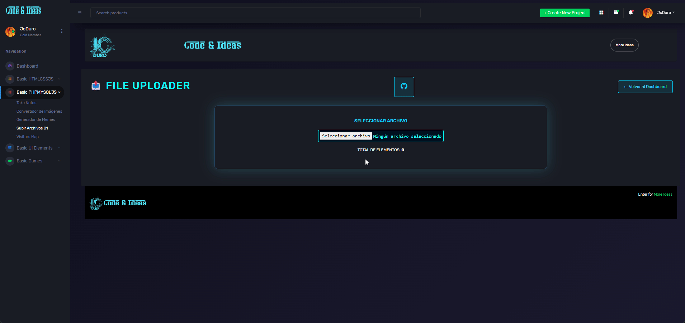

##🌟 File Uploader 01

Pequeña utilidad web para cargar y gestionar archivos en el servidor.  
Forma parte de los **proyectos de práctica** alojados en la Carpeta "aqui"

--- 

## ✨ Descripción

Este proyecto implementa una página sencilla que permite **seleccionar un archivo** desde el dispositivo del usuario para su posterior carga al servidor.[page:1]  
La interfaz muestra también el **total de elementos** disponibles en la ruta actual, comenzando en 0 mientras no existan archivos.[page:1]

---

##✨ Vista previa



---

## ✨ Pruebalo Online

[File_Uploader](https://jcduro.bexartideas.com/proyectos/dashjc/files_uploader_01/upload.php)

--- 

## ✨ Características

- Interfaz minimalista con botón de selección de archivo.[page:1]  
- Visualización del contador `TOTAL DE ELEMENTOS` en la carpeta actual.[page:1]  
- Preparado para extender con lógica de subida, listado y borrado de archivos.

--- 

## 🚀 Tecnologías

- HTML y CSS básicos para la interfaz inicial.[page:1]  
- Estructura pensada para integrarse con backend en PHP u otra tecnología similar.

--- 

## 🚀 Uso

1. Abrir la URL del proyecto en el navegador:  
   `https://jcduro.bexartideas.com/proyectos/files_uploader_01/`.[page:1]  
2. Utilizar el botón **SELECCIONAR ARCHIVO** para elegir un archivo local.[page:1]  
3. Visualizar el valor de **TOTAL DE ELEMENTOS** según los archivos disponibles en la ruta configurada.[page:1]

---

## 📊 Lenguajes y Herramientas

[](https://skillicons.dev)


---

## 🚀 Próximas mejoras

- Implementar la lógica de subida real de archivos al servidor.  
- Mostrar listado de archivos existentes con tamaño y fecha.  
- Permitir eliminación y descarga de archivos.  
- Manejo de errores y límites de tamaño/extensiones.

--- 

##🧾 Licencia

Este proyecto se distribuye libremente para uso personal o comercial.
Puedes modificarlo según tus necesidades, pero se recomienda mantener las medidas de seguridad integradas.


Abre el archivo desde tu navegador:

   ```bash
   https://github.com/jcduro/files_uploader_01/index.php

